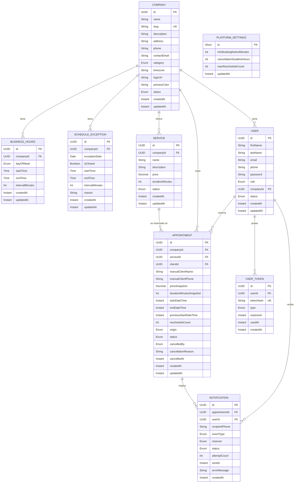

# 📚 5. Diccionario de Datos

Este documento define el **modelo lógico** del sistema: entidades, atributos, tipos y reglas de integridad.

- El **esquema físico** (DDL de PostgreSQL, DBML para diagramar, índices y constraints declarativas) vive en [esquema-bd.md](esquema-bd.md).
- Los nombres de entidades, atributos y enums están en inglés, según [convenciones técnicas](convenciones.md). Las descripciones se mantienen en español.

## Decisiones transversales del modelo

| Decisión | Definición | Motivo |
| :--- | :--- | :--- |
| **Tipo de PK** | `UUID` en todas las entidades (`gen_random_uuid()`). | Los IDs viajan en URLs públicas (`/{slug}`) y en respuestas de la API. Con `Long` autoincremental, cualquier visitante podría enumerar clientes y turnos de un negocio cambiando un número. |
| **Enums** | Se modelan como `varchar` + `CHECK` en la base, y `@Enumerated(EnumType.STRING)` en JPA. | Los enums nativos de PostgreSQL requieren manejo especial en Hibernate y `ALTER TYPE` para agregar valores. Con `varchar` + `CHECK` se obtiene la misma garantía sin fricción con el ORM ni con Flyway. |
| **Fechas y horas** | Instantes en `timestamptz` (UTC). Horas de pared (configuración de agenda) en `time`, interpretadas siempre en `company.timezone`. | Ver [regla de negocio 32](../negocio/reglas-negocio.md). Ninguna conversión usa la zona horaria del servidor. |
| **Borrado** | Lógico vía `status` en `Company`, `User` y `Service`. Físico solo en `BusinessHours` y `ScheduleException` (son configuración, no historial). | Se conserva el historial de turnos aunque se dé de baja la empresa o el servicio. |
| **Auditoría** | Todas las tablas llevan `createdAt` y `updatedAt`. | Los dashboards del superadmin (altas por mes) y del admin dependen de esto. Sin `createdAt` la métrica es imposible de calcular. |
| **Multi-tenant** | `companyId` denormalizado en `Appointment` + **FK compuestas**. | Ver nota al pie de `Appointment`. |

---

## ⚙️ Entidad: `PlatformSettings`

Parámetros de negocio configurables a nivel **global de la plataforma**, editables por el `SUPERADMIN`. Es una tabla de **una sola fila** (constraint `id = 1`).

| Atributo | Tipo de Dato | Restricciones | Descripción |
| :--- | :--- | :--- | :--- |
| `id` | `Short` | **PK**, `CHECK (id = 1)` | Fuerza que exista una única fila de configuración. |
| `minBookingNoticeMinutes` | `Int` | Not Null, Default `30`, `> 0` | Anticipación mínima para reservar un turno ([regla 15](../negocio/reglas-negocio.md)). |
| `cancellationDeadlineHours` | `Int` | Not Null, Default `3`, `> 0` | Plazo máximo para que el cliente cancele o reprograme ([regla 16](../negocio/reglas-negocio.md)). |
| `maxRescheduleCount` | `Int` | Not Null, Default `2`, `>= 0` | Cantidad máxima de reprogramaciones permitidas por turno ([regla 18](../negocio/reglas-negocio.md)). |
| `updatedAt` | `Instant` | Not Null | Última modificación. |

> 💡 **Por qué una tabla y no un `application.yml`:** los tres valores están documentados como *ajustables*. Si viven en el archivo de configuración, ajustarlos implica redeploy. En una tabla, el superadmin los edita desde su panel.

---

## 👥 Entidad: `User`

Representa a todos los actores del sistema (`SUPERADMIN`, `COMPANY_ADMIN` y `CLIENT`).

> ⚠️ **Regla de aislamiento de clientes:** un cliente que reserva en dos empresas distintas posee dos registros independientes de `User`, manteniendo el aislamiento total por `companyId`.

| Atributo | Tipo de Dato | Restricciones | Descripción |
| :--- | :--- | :--- | :--- |
| `id` | `UUID` | **PK**, Not Null | Identificador único del usuario. |
| `firstName` | `String` | Not Null | Nombre del usuario. |
| `lastName` | `String` | Not Null | Apellido del usuario. |
| `email` | `String` | Not Null, **Único por empresa** (case-insensitive) | Credencial de login. Ver nota de unicidad abajo. |
| `phone` | `String` | Not Null | Teléfono de contacto. Es el dato que usa `NotificationService` para enviar por WhatsApp. |
| `password` | `String` | Nullable | Hash de la contraseña (nunca en texto plano). Es `NULL` mientras el usuario está en `PENDING_ACTIVATION`. |
| `role` | `Enum` | Not Null | `SUPERADMIN`, `COMPANY_ADMIN`, `CLIENT`. |
| `companyId` | `UUID` | **FK** (`Company`), Nullable | Nulo **solo** para `SUPERADMIN`, garantizado por CHECK. |
| `status` | `Enum` | Not Null | `PENDING_ACTIVATION`, `ACTIVE`, `INACTIVE`. |
| `createdAt` | `Instant` | Not Null | Fecha de alta. |
| `updatedAt` | `Instant` | Not Null | Última modificación. |

**Reglas de integridad declaradas en la base:**

- `CHECK`: `role = 'SUPERADMIN'` ⇔ `companyId IS NULL`. La regla "nulo solo para superadmin" deja de ser una nota y pasa a ser una garantía del motor.
- Índice único parcial sobre `(companyId, lower(email))` cuando `companyId IS NOT NULL` → unicidad por empresa.
- Índice único parcial sobre `lower(email)` cuando `companyId IS NULL` → unicidad global entre superadmins.

> 📌 **Por qué dos índices y no uno:** en PostgreSQL los `NULL` se consideran distintos entre sí, así que un único `UNIQUE (company_id, email)` permitiría dos superadmins con el mismo email. El `lower()` evita que `Juan@mail.com` y `juan@mail.com` convivan como cuentas distintas y vuelvan ambiguo el login.

> 📌 **Consecuencia asumida:** como la unicidad es por `(companyId, email)` sin discriminar el rol, el admin de una empresa **no puede** además tener una cuenta de cliente en su propia empresa con el mismo email. Es una decisión tomada a propósito: si necesita reservarse un turno, lo carga como reserva manual desde su turnero.

---

## 🔑 Entidad: `UserToken`

Tokens de un solo uso para activación de cuenta y recuperación de contraseña (ver [detalle de flujos 7.1](../negocio/detalles-flujos.md)).

| Atributo | Tipo de Dato | Restricciones | Descripción |
| :--- | :--- | :--- | :--- |
| `id` | `UUID` | **PK**, Not Null | Identificador interno del token. |
| `userId` | `UUID` | **FK** (`User`), Not Null | Usuario al que pertenece el token. |
| `tokenHash` | `String` | Not Null, **Único** | Hash del token que viaja en el link. **Nunca se guarda el token en claro.** |
| `type` | `Enum` | Not Null | `ACTIVATION`, `PASSWORD_RESET`. |
| `expiresAt` | `Instant` | Not Null | Vencimiento (48 hs para `ACTIVATION`, 1 hora para `PASSWORD_RESET`). |
| `usedAt` | `Instant` | Nullable | Nulo mientras no se usó. Al usarse se sella, garantizando el "un solo uso". |
| `createdAt` | `Instant` | Not Null | Fecha de emisión. |

> 🔒 **Por qué se guarda el hash y no el token:** es el mismo criterio ya aplicado a `password`. Si alguien obtiene lectura de la base, con el token en claro podría activar cuentas ajenas o resetear contraseñas; con el hash, no. El link se arma con el valor en claro una sola vez, al momento de generarlo.

> 📌 Reenviar un link de activación (RF del superadmin) invalida los tokens `ACTIVATION` anteriores de ese usuario y emite uno nuevo.

---

## 🏢 Entidad: `Company`

Representa cada uno de los negocios o comercios dados de alta en la plataforma.

| Atributo | Tipo de Dato | Restricciones | Descripción |
| :--- | :--- | :--- | :--- |
| `id` | `UUID` | **PK**, Not Null | Identificador único de la empresa. |
| `name` | `String` | Not Null | Nombre comercial de la empresa. |
| `slug` | `String` | Not Null, **Único**, `CHECK` de formato | Identificador de URL pública (`plataforma.com/{slug}`). No editable. |
| `description` | `String` | Nullable | Descripción pública del negocio. |
| `address` | `String` | Nullable | Dirección física del comercio. |
| `phone` | `String` | Nullable | Teléfono principal de contacto. |
| `contactEmail` | `String` | Nullable | Correo electrónico de contacto institucional. |
| `category` | `Enum` | Not Null | Rubro del negocio. Ver nota abajo. |
| `timezone` | `String` | Not Null, Default `America/Argentina/Cordoba` | Zona horaria IANA del negocio. Ver nota abajo. |
| `logoUrl` | `String` | Nullable | URL de la imagen del logo (requiere *storage* externo). |
| `primaryColor` | `String` | Nullable, `CHECK ~ '^#[0-9A-Fa-f]{6}$'` | Código HEX para personalización de marca. |
| `status` | `Enum` | Not Null | `ACTIVE`, `INACTIVE` *(borrado lógico)*. |
| `createdAt` | `Instant` | Not Null | Fecha de alta. **Insumo del dashboard "altas por mes".** |
| `updatedAt` | `Instant` | Not Null | Última modificación. |

> 🌎 **Por qué `timezone` es obligatorio:** `BusinessHours.startTime` es una hora de pared (`09:00`), sin zona. Para saber a qué instante UTC corresponde "el lunes a las 09:00" hace falta una zona horaria explícita. Sin esta columna, el cálculo tomaría la zona del proceso Java — que en el contenedor de Render es UTC — y el sistema ofrecería y guardaría turnos corridos 3 horas. El valor default cubre el caso real del proyecto, pero la conversión nunca depende del servidor.

> 🏷️ **Por qué `category` es un enum y no texto libre:** el RF del superadmin pide "distribución por rubro". Con texto libre, `Peluquería`, `peluqueria` y `Peluqueria` cuentan como tres rubros distintos y el gráfico queda inutilizable.

> 🔗 **Slugs reservados:** como la URL pública es `plataforma.com/{slug}`, el slug compite con las rutas propias de la aplicación. El alta valida contra una lista de reservados (`api`, `login`, `logout`, `admin`, `superadmin`, `company`, `register`, `activate`, `reset-password`, `assets`, `static`, `public`, `docs`, `health`) además de verificar que no exista.

---

## ✂️ Entidad: `Service`

Catálogo de prestaciones ofrecidas por cada empresa.

| Atributo | Tipo de Dato | Restricciones | Descripción |
| :--- | :--- | :--- | :--- |
| `id` | `UUID` | **PK**, Not Null | Identificador único del servicio. |
| `companyId` | `UUID` | **FK** (`Company`), Not Null | Empresa a la que pertenece el servicio. |
| `name` | `String` | Not Null | Nombre del servicio. |
| `description` | `String` | Nullable | Detalle o alcance del servicio. |
| `price` | `Decimal(10,2)` | Not Null, `>= 0` | Precio **vigente** del servicio. |
| `durationMinutes` | `Int` | Not Null, `> 0` | Duración **vigente** en minutos. |
| `status` | `Enum` | Not Null | `ACTIVE`, `INACTIVE`. |
| `createdAt` | `Instant` | Not Null | Fecha de alta. |
| `updatedAt` | `Instant` | Not Null | Última modificación. |

> 💡 **Nota de inmutabilidad:** desactivar un servicio (`INACTIVE`) no altera ni elimina los turnos previamente reservados con dicho servicio.

> ⚠️ **`price` y `durationMinutes` son valores *vigentes*, no históricos.** Definen el default al momento de reservar; el turno guarda su propia copia (ver `Appointment`). Editar un servicio nunca modifica turnos ya reservados.

---

## 🕐 Entidad: `BusinessHours`

Plantilla **recurrente** de atención por día de la semana. Es la base del cálculo de disponibilidad.

| Atributo | Tipo de Dato | Restricciones | Descripción |
| :--- | :--- | :--- | :--- |
| `id` | `UUID` | **PK**, Not Null | Identificador único de la regla de horario. |
| `companyId` | `UUID` | **FK** (`Company`), Not Null | Empresa a la que pertenece el horario. |
| `dayOfWeek` | `Enum` | Not Null | `MONDAY` a `SUNDAY`. |
| `startTime` | `Time` | Not Null | Hora de apertura, en `company.timezone`. |
| `endTime` | `Time` | Not Null, `> startTime` | Hora de cierre, en `company.timezone`. |
| `intervalMinutes` | `Int` | Not Null, `> 0` | Frecuencia en minutos para ofrecer inicio de turnos. |
| `createdAt` | `Instant` | Not Null | Fecha de alta. |
| `updatedAt` | `Instant` | Not Null | Última modificación. |

> ✅ **Se admiten varias filas para el mismo día** (jornada partida: lunes 09:00–13:00 y 16:00–20:00). Una constraint de exclusión impide que dos filas del mismo día y empresa se superpongan.
>
> Un día **sin ninguna fila** significa que la empresa no atiende ese día de la semana.

---

## 📆 Entidad: `ScheduleException`

Excepciones puntuales al calendario, **por fecha concreta**: feriados, vacaciones o una jornada con horario especial. Las administra cada admin de empresa.

| Atributo | Tipo de Dato | Restricciones | Descripción |
| :--- | :--- | :--- | :--- |
| `id` | `UUID` | **PK**, Not Null | Identificador único de la excepción. |
| `companyId` | `UUID` | **FK** (`Company`), Not Null | Empresa a la que pertenece la excepción. |
| `exceptionDate` | `Date` | Not Null, **Único por empresa** | Fecha concreta afectada (no es recurrente). |
| `isClosed` | `Boolean` | Not Null, Default `true` | `true` = cerrado todo el día. `false` = abre con horario especial. |
| `startTime` | `Time` | Nullable | Solo si `isClosed = false`. |
| `endTime` | `Time` | Nullable, `> startTime` | Solo si `isClosed = false`. |
| `intervalMinutes` | `Int` | Nullable, `> 0` | Solo si `isClosed = false`. |
| `reason` | `String` | Nullable | Texto libre visible en el panel (ej. "Feriado nacional"). |
| `createdAt` | `Instant` | Not Null | Fecha de alta. |
| `updatedAt` | `Instant` | Not Null | Última modificación. |

**Regla de precedencia:** si existe una `ScheduleException` para una fecha, **reemplaza por completo** la configuración de `BusinessHours` de ese día de la semana. No se combinan.

> 📌 Un `CHECK` garantiza la coherencia: si `isClosed = true`, los tres campos de horario deben ser nulos; si es `false`, los tres deben estar cargados.

> 📌 Igual que al editar `BusinessHours`, cargar una excepción **no cancela** turnos ya reservados en esa fecha: el sistema informa cuántos quedan fuera y el admin decide ([regla 27](../negocio/reglas-negocio.md)).

---

## 📅 Entidad: `Appointment`

Registro de las citas o reservas del sistema. Es un **snapshot inmutable de lo pactado**, no una referencia viva al catálogo.

| Atributo | Tipo de Dato | Restricciones | Descripción |
| :--- | :--- | :--- | :--- |
| `id` | `UUID` | **PK**, Not Null | Identificador único del turno. |
| `companyId` | `UUID` | **FK** (`Company`), Not Null | Empresa en la que se efectúa la reserva. |
| `serviceId` | `UUID` | **FK compuesta** (`Service`), Not Null | Servicio reservado. |
| `clientId` | `UUID` | **FK compuesta** (`User`), Nullable | Cliente con cuenta vinculada. Nulo en reservas manuales sin cuenta. |
| `manualClientName` | `String` | Nullable | Usado **solo** si `clientId` es `NULL`. |
| `manualClientPhone` | `String` | Nullable | Usado **solo** si `clientId` es `NULL`. |
| `priceSnapshot` | `Decimal(10,2)` | Not Null, `>= 0` | Precio del servicio **al momento de reservar**. |
| `durationMinutesSnapshot` | `Int` | Not Null, `> 0` | Duración del servicio **al momento de reservar**. |
| `startDateTime` | `Instant` | Not Null | Inicio del turno (UTC). |
| `endDateTime` | `Instant` | Not Null | Fin del turno (UTC). Derivado: `startDateTime + durationMinutesSnapshot`. |
| `previousStartDateTime` | `Instant` | Nullable | Horario inmediatamente anterior, si fue reprogramado. |
| `rescheduleCount` | `Int` | Not Null, Default `0` | Cantidad de reprogramaciones aplicadas. Tope en `PlatformSettings.maxRescheduleCount`. |
| `origin` | `Enum` | Not Null | `ONLINE` (reservado por el cliente) o `MANUAL` (cargado por el admin). |
| `status` | `Enum` | Not Null | `PENDING`, `COMPLETED`, `CANCELLED`. |
| `cancelledBy` | `Enum` | Nullable | `CLIENT` o `COMPANY`. |
| `cancellationReason` | `String` | Nullable | Motivo en texto libre. |
| `cancelledAt` | `Instant` | Nullable | Momento de la cancelación. |
| `createdAt` | `Instant` | Not Null | Momento de la reserva. |
| `updatedAt` | `Instant` | Not Null | Última modificación. |

### Por qué el turno guarda su propio precio y duración

Sin el snapshot, la duración del turno saldría de `service.durationMinutes`, que **es editable**. Si un negocio tiene 20 turnos de "Corte" reservados a 30 minutos y el admin edita el servicio a 60, esos 20 turnos cambiarían de duración de forma retroactiva y pasarían a superponerse entre sí: la agenda se rompe sin que nadie haya tocado un turno. Con el snapshot, editar el catálogo solo afecta a las reservas futuras. El mismo argumento aplica a `price`: el turno conserva el valor al que se pactó.

`endDateTime` se persiste (no se calcula al vuelo) porque es lo que permite validar superposiciones por rango con un índice y con la constraint de exclusión descrita en [esquema-bd.md](esquema-bd.md), y porque es el corte que usa el job de cierre para pasar un turno a `COMPLETED` ([regla 34](../negocio/reglas-negocio.md)). Lo escribe la capa de servicio en cada alta y en cada reprogramación.

### Por qué `companyId` está en `Appointment` si es deducible de `Service`

Es una **denormalización intencional**, no un error de normalización. Sostiene tres cosas que de otro modo requerirían un `JOIN` en cada consulta: el índice del turnero (`companyId, status, startDateTime`), el filtro de aislamiento multi-tenant en toda la capa de datos, y la constraint de exclusión que impide superposiciones dentro de un mismo negocio.

### Por qué las FK a `Service` y `User` son compuestas

Con tres FK independientes, nada impediría un turno de la empresa A apuntando a un servicio de la empresa B: un bug en la capa de servicio, o un `serviceId` manipulado en el request, produciría un registro que mezcla dos negocios y la base lo aceptaría. Declarando `UNIQUE (id, companyId)` en `Service` y `User`, y referenciando desde `Appointment` con `(serviceId, companyId)` y `(clientId, companyId)`, **el aislamiento entre empresas deja de depender de que el código no tenga errores** y pasa a ser una garantía del motor.

### Estados y transiciones

```text
                  ┌──────────────┐
   reserva  ─────►│   PENDING    │
                  └──────┬───────┘
                         │
          ┌──────────────┼──────────────┐
          │              │              │
   reprogramación   job programado   cancelación
   (mismo registro,  (endDateTime     (cliente o admin)
    sigue PENDING,    ya pasó)              │
    +1 reschedule)         │                ▼
          │                ▼          ┌──────────────┐
          └──────►  ┌──────────────┐  │  CANCELLED   │ ◄── terminal
                    │  COMPLETED   │  └──────────────┘
                    └──────────────┘
```

`CANCELLED` es terminal: nunca pasa a `COMPLETED`. La reprogramación **no** es un estado, es un evento contabilizado en `rescheduleCount` (ver nota de diseño al pie).

**Coherencia garantizada por `CHECK`:**

- `clientId` cargado ⊻ (`manualClientName` + `manualClientPhone`) cargados. Impide el "turno fantasma": sin cuenta y sin datos de contacto, nadie podría avisarle a esa persona.
- `status = 'CANCELLED'` ⇔ `cancelledBy` y `cancelledAt` cargados.
- `rescheduleCount > 0` ⇔ `previousStartDateTime` cargado.

---

## 🔔 Entidad: `Notification`

Registro de cada notificación emitida por `NotificationService`.

| Atributo | Tipo de Dato | Restricciones | Descripción |
| :--- | :--- | :--- | :--- |
| `id` | `UUID` | **PK**, Not Null | Identificador único de la notificación. |
| `appointmentId` | `UUID` | **FK** (`Appointment`), Nullable | Turno asociado. Nulo para eventos de cuenta (activación, reset). |
| `userId` | `UUID` | **FK** (`User`), Nullable | Destinatario con cuenta. Nulo si es un cliente manual sin cuenta. |
| `recipientPhone` | `String` | Not Null | Teléfono efectivamente usado para el envío. |
| `eventType` | `Enum` | Not Null | `BOOKING_CONFIRMED`, `APPOINTMENT_CANCELLED`, `APPOINTMENT_RESCHEDULED`, `ACCOUNT_ACTIVATION`, `PASSWORD_RESET`. |
| `channel` | `Enum` | Not Null | `WHATSAPP`, `EMAIL`. |
| `status` | `Enum` | Not Null | `PENDING`, `SENT`, `FAILED`. |
| `attemptCount` | `Int` | Not Null, Default `0` | Cantidad de intentos de envío. |
| `sentAt` | `Instant` | Nullable | Momento del envío exitoso. |
| `errorMessage` | `String` | Nullable | Detalle del error del proveedor, si falló. |
| `createdAt` | `Instant` | Not Null | Momento en que se encoló la notificación. |

> 💡 **Por qué persistir las notificaciones:** el canal es una API externa (WhatsApp Business). Sin registro, un timeout deja al sistema sin saber si el mensaje salió, sin posibilidad de reintentar y sin forma de evitar un envío duplicado. El caso más sensible es la [regla 7](../negocio/reglas-negocio.md): al desactivar una empresa se cancelan N turnos y se notifica a N clientes; si ese proceso se corta a la mitad, al reintentarlo los primeros recibirían el aviso dos veces.
>
> Para la defensa del trabajo, además, es lo que permite **demostrar** que el flujo de notificaciones funciona en lugar de afirmarlo.

> 📌 `recipientPhone` se copia en vez de leerse por FK para que el registro histórico refleje a dónde se envió realmente, aunque el usuario cambie su teléfono después.

---

## 🔗 Diagrama Entidad-Relación



`PLATFORM_SETTINGS` no tiene relaciones: es configuración global de fila única.

---

## 📎 Nota de diseño — por qué `RESCHEDULED` dejó de ser un estado

La versión previa del modelo incluía `RESCHEDULED` dentro de `status`. Se quitó porque mezclaba dos ejes independientes: el **ciclo de vida** del turno (pendiente → completado / cancelado) y un **evento** que le ocurrió (fue reprogramado). Dos consecuencias concretas:

1. Un turno reprogramado que ya pasó se convertía en `COMPLETED` y **perdía el dato** de que había sido reprogramado, dejando `previousStartDateTime` sin contexto.
2. Con un tope de dos reprogramaciones ([regla 18](../negocio/reglas-negocio.md)), el estado no alcanzaba para saber cuántas se llevaban usadas.

Con `rescheduleCount`, un turno reprogramado sigue siendo `PENDING` — que es lo que realmente es — y el filtro de "Mis turnos" sigue funcionando (`rescheduleCount > 0`), con la ventaja de que el dato sobrevive a la transición a `COMPLETED`.
